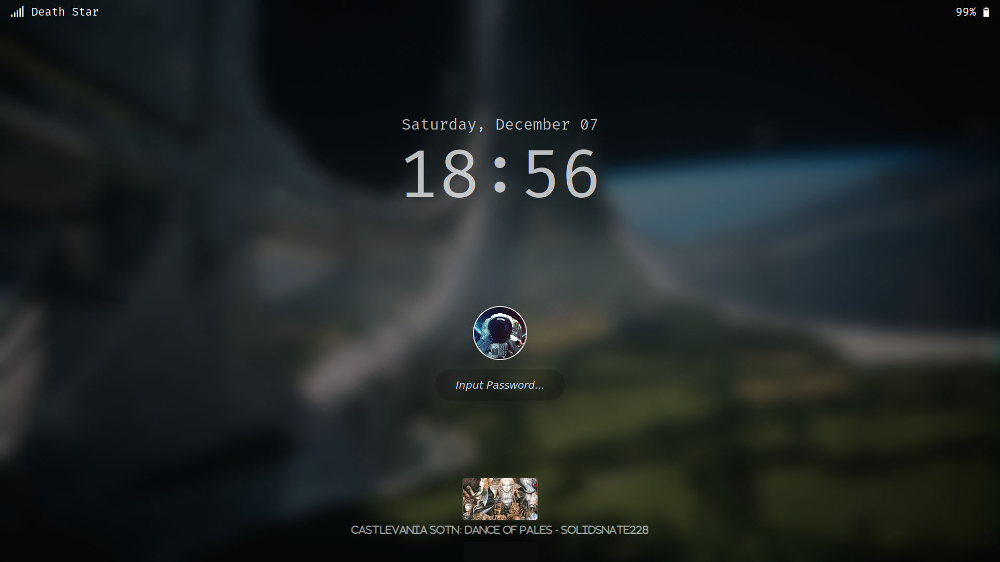
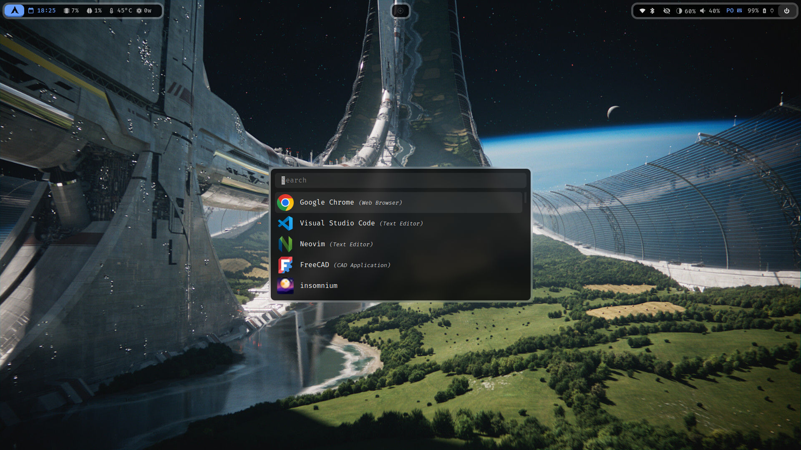
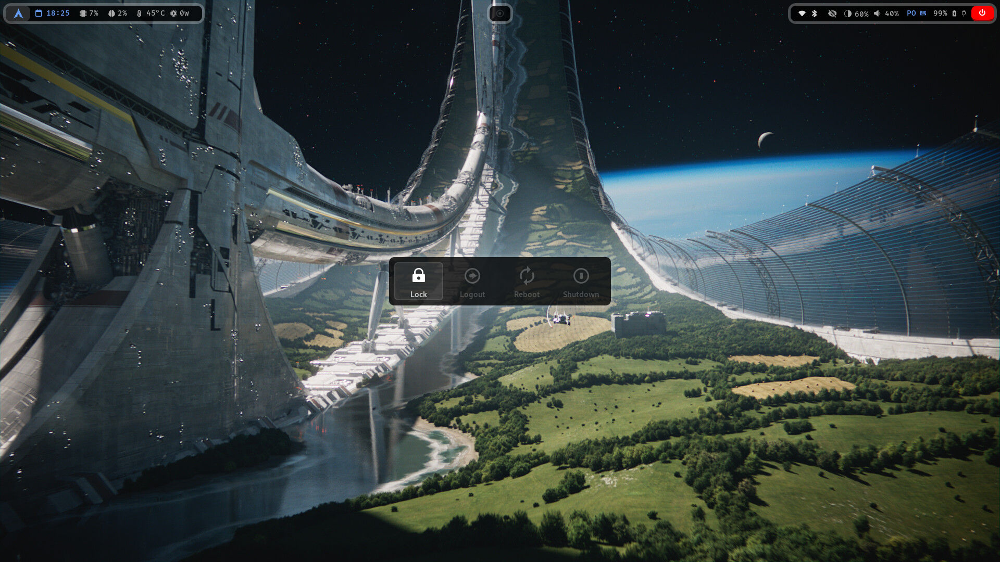
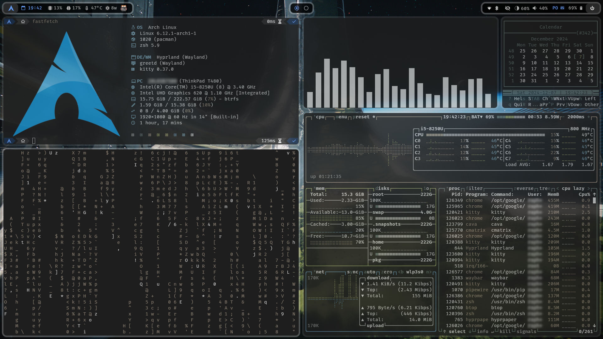
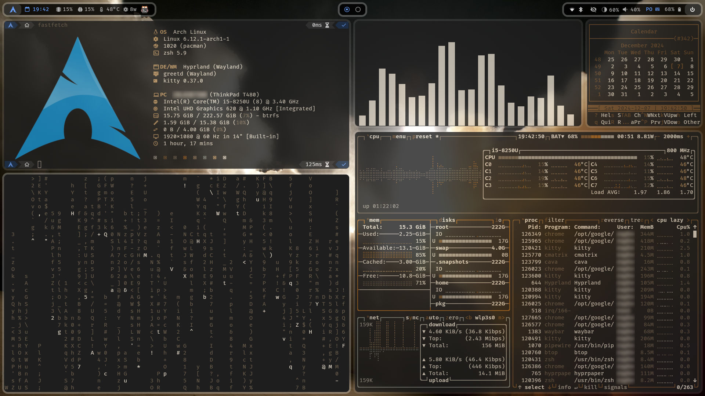
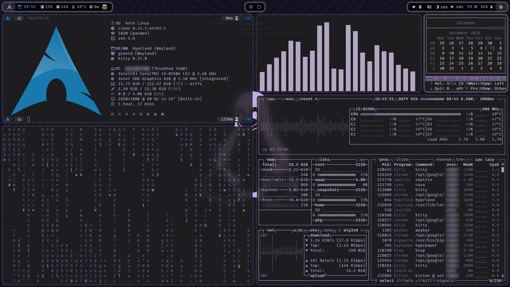
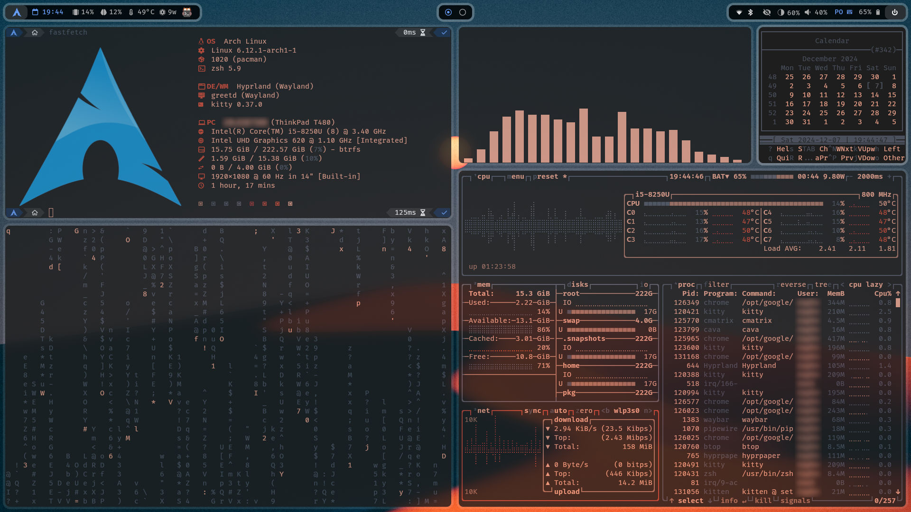

# AHA - Arch Hyprland Ansible

A simple intallation of Hyprland with my Dotfiles into Arch Linux and automated by ansible.

My Dotfiles are here: https://github.com/odevsa/dotfiles

## Disclaimer

This is for my personal use and it's working in progress, so files can be deleted, things can break, etc. If you want to try it, it`s for your own risk.

## Important

It's in progress, so please EXECUTE ONLY ONCE.

It's needing of some check before to do changes in files of the system yet, so if you execute more then one time, the changes will be duplicated in files.

## Screenshots





|                                    |                                    |
| :--------------------------------: | :--------------------------------: |
|  |  |
|  |  |

## What does this do?

- [x] Update
- [x] Copy dotfiles (custom dotfiles see: [common/vars/main.yml](common/vars/main.yml))
- [x] Codecs (audio, image and video)
- [x] Main file compressors (zip, unrar, p7zip...)
- [x] Multimedia core (mesa, vulkan, network, bluetooth, pipewire...)
- [x] Popular development packages (git, rust, python, nodejs...)
- [x] Zsh (set as default, oh-my-posh, oh-my-zsh, sintax-highlight, autosuggestion)
- [x] :checkered_flag: - Amdgpu
- [x] :checkered_flag: - Nvidia
- [x] Fonts (font-awesome, firacode-nerd)
- [x] Icon Theme (Papirus)
- [x] Terminal Applications (fastfetch, neovim, btop...)
- [x] :checkered_flag: - Utilities Applications (nautilus, file-roller, snapshot, totem...)
- [x] :checkered_flag: - Development Applications (spacevim, dbeaver, docker...)
- [x] :checkered_flag: - Graphical Applications (gimp, inkscape)
- [x] :checkered_flag: - Multimedia Applications (audacity, obs-studio, kdenlive)
- [x] :checkered_flag: - 3D Applications (blender, freecad)
- [x] :checkered_flag: - Browser (firefox | chromium | vivaldi | google-chrome)
- [x] :checkered_flag: - Laptop battery optimization (autocpufreq)
- [x] :checkered_flag: - AUR Support (yay)
- [x] Hyprland (kitty, waybar, rofi-wayland, swww, hyprlock, nwg-bar, grim, slurp...)
- [x] Dysplay Manager (greetd)

:checkered_flag: = Optional installation, see: [common/vars/main.yml](common/vars/main.yml)

## Shortcuts

- [SUPER] Applications
- [SUPER]+[T] Terminal
- [SUPER]+[Q] Close active window
- [SUPER]+[W] Change randomly wallpaper in `~/Pictures/Wallpapers`
- [SUPER]+[E] File manager
- [SUPER]+[F] Toggle floating
- [SUPER]+[M] Restart Hyprland
- [SUPER]+[B] Restart bar
- [SUPER]+[SHIFT]+[B] Hide bar
- [SUPER]+[L] Lock screen
- [SUPER]+[ESC] Power options

## TODO

- [ ] Fix: US Keyboard layout cedilla module to write `ç` with [']+[c]
- [ ] Fix: GTK apps delays to open at the first time
- [ ] Fix: GTK portal icon theme
- [ ] Save file association
- [ ] Remake bar, maybe using AGS

## What you will need

- Any distribution based on Arch Linux, preferably a clean installation of Arch Linux with systemd-boot (grub not tested yet).
- Internet connection:

  - Ethernet
  - Wifi with `iwctl`

    ```
    $ iwctl

    [iwctl]# station <DEVICE> connect "<SSID>"
    ```

  - Wifi with `NetworkManager`
    ```
    $ nmcli device wifi connect "<SSID>" --ask
    ```

## Automatic Install

Just run this code and see the magic

```
sh -c "$(curl -fsSL https://raw.githubusercontent.com/odevsa/aha/main/install.sh)"
```

You may want to use flags to customize installation

| Flag          | Description                                                                                       |
| ------------- | ------------------------------------------------------------------------------------------------- |
| `--no-amdgpu` | Disables the installation of AMD GPU (amdgpu).                                                    |
| `--no-nvidia` | Disables the installation of NVIDIA GPU (nvidia).                                                 |
| `--no-gpu`    | Disables the installation of both AMD and NVIDIA GPUs.                                            |
| `--no-apps`   | Disables all application-related installations.                                                   |
| `--only-core` | Installs only core system components, disabling other features like applications and GPU drivers. |

For example: If you don't want Nvidia driver and default applications, you can try:

```
sh -c "$(curl -fsSL https://raw.githubusercontent.com/odevsa/aha/main/install.sh)" -- --no-nvidia --no-apps
```

## Manual Install

- Install necessary dependencies

  ```
  sudo pacman -S git python ansible
  ```

- Clone the repo

  ```
  git clone https://github.com/odevsa/aha.git
  ```

- Enter in folder

  ```
  cd aha
  ```

- Customize the file [common/vars/main.yml](common/vars/main.yml) as you need

- Run ansible
  ```
  ansible-playbook main.yml
  ```
- Input sudo password when it ask for
